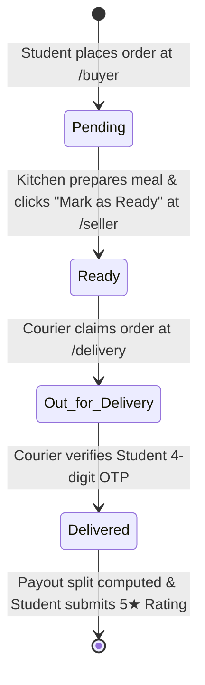

# 🍔 University Canteen Food Delivery System

A complete full-stack food ordering, fulfillment, and campus courier delivery ecosystem designed specifically for university campuses. The platform seamlessly connects **Students (Buyers)**, **Canteen Outlets (Sellers)**, **Student Couriers (Delivery Partners)**, and **University Administration** into a single synchronized workflow.

---

## 📑 Table of Contents

- [Overview & System Architecture](#-overview--system-architecture)
- [Comprehensive Role Breakdown & How It Works](#-comprehensive-role-breakdown--how-it-works)
  - [1. Student / Buyer Role](#1-student--buyer-role)
  - [2. Canteen Shop / Seller Role](#2-canteen-shop--seller-role)
  - [3. Delivery Partner / Courier Role](#3-delivery-partner--courier-role)
  - [4. Platform Administrator Role](#4-platform-administrator-role)
- [End-to-End Order Lifecycle & State Machine](#-end-to-end-order-lifecycle--state-machine)
- [Technology Stack](#-technology-stack)
- [Project Directory Layout](#-project-directory-layout)
- [Installation & Quick Start](#-installation--quick-start)
- [Access Portals & Default Credentials](#-access-portals--default-credentials)
- [Printable PDF Reference Directories](#-printable-pdf-reference-directories)
- [Commission & Fee Distribution Model](#-commission--fee-distribution-model)
- [Codebase Commenting & Developer Standards](#-codebase-commenting--developer-standards)
- [REST API Reference](#-rest-api-reference)
- [Database Schema & Entity Relations](#-database-schema--entity-relations)
- [Troubleshooting & Maintenance](#-troubleshooting--maintenance)

---

## 🏛 Overview & System Architecture

```
                               ┌────────────────────────────────┐
                               │   University Student / Buyer   │
                               │  - Browse Menu & Cart (৳ BDT)  │
                               │  - Place Order & Track Status  │
                               │  - Secure OTP Delivery Handover│
                               │  - Leave Ratings & Feedback    │
                               └──────────────┬─────────────────┘
                                              │ Places Order
                                              ▼
┌──────────────────────────────┐        ┌──────────────────────────────┐
│  Seller (Canteen Outlet)     │        │   FastAPI Core Application   │
│  - Manage Stock & Menu Items │◄───────┤  - RESTful Endpoints & Auth  │
│  - Live Incoming Orders Feed │ Orders │  - OTP Handshake Engine      │
│  - Single-Click "Ready" Flag │        │  - SQLite Database Engine    │
└──────────────┬───────────────┘        └──────────────┬───────────────┘
               │ Order Ready                           │
               ▼                                       │ Real-time Data
┌──────────────────────────────┐                       │
│  Delivery Partner (Rider)    │                       ▼
│  - Claim "Ready" Orders Pool │        ┌──────────────────────────────┐
│  - Out-for-Delivery Flow     │        │   Admin Control Center       │
│  - OTP Verification Handshake│        │  - Live KPI Badges & Trends  │
│  - Balance & Earnings Ledger │        │  - Dynamic Fee Split Policy  │
└──────────────────────────────┘        │  - Shop & Rider Oversight    │
                                        │  - Notifications & Audit Log │
                                        └──────────────────────────────┘
```

---

## 👥 Comprehensive Role Breakdown & How It Works

### 1. Student / Buyer Role

The **Buyer Portal (`/buyer`)** gives students an intuitive, fast, and mobile-friendly food ordering experience across all campus dining options.

```
Browse Menu ➔ Filter by Meal / Shop ➔ Add to Cart ➔ Checkout (Name, ID, Phone, Building) ➔ Track Order ➔ OTP Handover ➔ Submit Rating
```

#### Detailed Functionality:
* **Interactive Food Discovery**:
  - Browse food items from all 14 university canteen shops in an optimized 2-column mobile responsive grid.
  - Filter meals instantly by category: **Breakfast**, **Lunch**, **Snacks**, **Beverages**, or specific campus shops.
  - View food availability, item descriptions, price tags in Bangladeshi Taka (`৳`), and star ratings.
* **Smart Cart & Real-Time Price Engine**:
  - Add items from multiple outlets, adjust quantities on the fly, and view itemized sub-totals with zero page reloads.
* **Campus Checkout Flow**:
  - Enter student details: **Full Name**, **Student ID**, **Phone Number**, and **Campus Delivery Spot** (Faculty Building, Department Room, Hall of Residence, or Library).
  - Generates a unique numeric **Order ID** and creates a cryptographically secure 4-digit **Delivery OTP**.
* **Live Order Tracking**:
  - Live progress tracker showing order state transitions in real time:
    $$\text{Pending (Kitchen Prep)} \longrightarrow \text{Ready (Pickup)} \longrightarrow \text{Out for Delivery} \longrightarrow \text{Delivered}$$
* **Secure OTP Handover**:
  - When the rider arrives at the student's location, the student provides their 4-digit OTP to confirm delivery.
* **Ratings & Feedback**:
  - Once delivered, students submit 1-to-5 star ratings and reviews to help maintain high culinary standards across campus.

---

### 2. Canteen Shop / Seller Role

The **Seller Portal (`/seller`)** empowers campus kitchen managers to operate their digital storefront, control their inventory, and process incoming student meal tickets.

```
Seller Login (Shop ID + Password) ➔ Manage Menu & Pricing ➔ Receive Incoming Order ➔ Prepare Food ➔ Click "Mark as Ready" ➔ Track Payouts
```

#### Detailed Functionality:
* **Authentication & Session Persistence**:
  - Canteen vendors log in with their assigned Shop ID (`shop_1` to `shop_14`) and password.
  - Browser session persistence keeps vendors logged in even across refreshes and tab reopens.
* **Menu & Stock Management**:
  - **Add New Dishes**: Upload food title, price (`৳`), stock count, category tag (Breakfast, Lunch, Snacks, etc.), and food image URL.
  - **Edit & Adjust**: Change pricing, update descriptions, and toggle in-stock / out-of-stock statuses with single-click modal forms.
  - **Delete Items**: Safely remove discontinued food items from the public marketplace.
* **Order Fulfillment Pipeline**:
  - **Incoming Order Feed**: Displays new student orders with buyer name, contact phone, item quantities, and special notes.
  - **Preparation Stage**: Kitchen cooks prepare the food while the order remains in `Pending`.
  - **Mark as Ready**: Once cooked and packaged, the seller clicks **"Mark as Ready"**, which instantly pushes the order into the active Courier Claim Pool for pickup.
* **Financial Summary & Broadcast Alerts**:
  - View gross revenue, deducted platform commission fees, and net shop earnings.
  - Receive direct announcements and notifications broadcasted by university administrators.

---

### 3. Delivery Partner / Courier Role

The **Delivery Portal (`/delivery`)** serves student couriers who earn income delivering hot meals between canteen kitchens and campus faculty buildings or dormitories.

```
Rider Login (Boy ID + Pass) ➔ View Available Orders Pool ➔ Claim Order (Out for Delivery) ➔ Pick Up from Shop ➔ Handover & Verify OTP ➔ Earn Commission
```

#### Detailed Functionality:
* **Courier Authentication**:
  - Registered riders log in using their unique Delivery Boy ID (`DB001` – `DB154`) and secure password.
* **Real-time Order Claiming Pool**:
  - Couriers view an active pool of orders that have been marked as **"Ready"** by canteen shops.
  - Each listing displays the pickup canteen name, customer delivery destination, order items, and delivery fee bounty.
* **Claim & Route Management**:
  - Claiming an order immediately assigns the rider to the ticket and updates its status to **`Out for Delivery`**, notifying the student that their food is on its way.
* **OTP Verification Handshake**:
  - Couriers navigate to the destination building, meet the student, and ask for their 4-digit OTP.
  - The courier submits the OTP in their portal; once validated by the backend engine, the order is marked **`Delivered`**.
* **Earnings Ledger**:
  - Automatically accrues delivery share earnings per completed trip (e.g. 3.0% of order value or fixed delivery fee).
  - Displays lifetime earnings and total successful deliveries.

---

### 4. Platform Administrator Role

The **Admin Portal (`/admin`)** provides full administrative governance, analytics, moderation, and policy configuration for university authorities.

```
Admin Login (/admin) ➔ Live KPI Dashboard ➔ Analytics Charts ➔ Shops & Foods Roster ➔ Rider Management ➔ Moderation ➔ Notifications Hub ➔ Dynamic Fee Settings
```

#### Detailed Functionality:
* **Live KPI Badges & Section Totals**:
  - Every sidebar menu item and section header displays dynamic live counter badges:
    - 🏪 **Shops**: 14 active campus outlets
    - 🍱 **Foods**: 180+ menu items
    - 📦 **Orders**: 6,000+ completed & active orders
    - 🚴 **Delivery Riders**: 154 registered student couriers
    - ⭐ **Ratings**: 2,400+ customer reviews
    - 📢 **Complaints**: 650+ student support tickets
    - 📜 **Activity Logs**: 130+ timestamped audit logs
    - 🔔 **Notifications**: 1,000+ targeted alert messages
* **Visual Analytics Engine (Chart.js)**:
  - **14-Day Revenue Trend**: Daily gross sales in BDT (`৳`).
  - **Order Status Distribution**: Doughnut breakdown of Pending, Ready, Out for Delivery, and Delivered orders.
  - **Orders by Shop**: Comparative bar chart of order volume across canteen outlets.
  - **Customer Rating Distribution**: Star rating sentiment breakdown (1★ to 5★).
  - **Top 5 Bestselling Foods**: Most frequently ordered meals on campus.
* **Full Moderation & Audit Control**:
  - Add or ban shops, update canteen contact info, and inspect menu items.
  - Review student complaints with attached evidence images and update ticket resolution statuses.
  - Review chronological system audit logs for administrative actions, logins, and policy adjustments.
* **Dedicated Notifications Dispatcher**:
  - Centralized notification management page with status filters (Read / Unread) and pagination (`10`, `25`, `50`, `100`, `All`).
  - Broadcast administrative notices to individual canteen shops or all outlets simultaneously.
* **Commission & Fee Policy Management (with Live Simulator)**:
  - Configure the **Platform Admin Commission** (e.g. `4.0%`) and **Delivery Rider Share** (e.g. `3.0%`).
  - Interactive quick-preset chips (`1.0%`, `1.5%`, `2.0%`, `3.0%`, `4.0%`, `5.0%`, `10.0%`).
  - **Live Order Split Simulator**: Drag the slider (`৳50` – `৳2,500`) to preview 3-part payout allocations (Shop Net, Admin Revenue, Rider Earnings) with real-time visual progress bars.

---

## 🔄 End-to-End Order Lifecycle & State Machine



| Step | Triggering Role | Action | System Status | Data Updates |
|---|---|---|---|---|
| **1. Checkout** | Student (Buyer) | Submits cart at `/buyer` | `Pending` | Generates Order ID, assigns 4-digit OTP, reserves food stock |
| **2. Prep** | Canteen Shop | Clicks "Mark as Ready" at `/seller` | `Ready` | Moves order to courier claim pool, notifies student |
| **3. Claim** | Delivery Courier | Clicks "Accept Order" at `/delivery` | `Out for Delivery` | Binds rider ID to order, displays delivery destination |
| **4. Handover** | Courier & Student | Courier enters student's OTP | `Delivered` | Validates OTP match, marks complete, credits rider balance |
| **5. Feedback**| Student (Buyer) | Submits review & stars | `Delivered` | Links rating to food item and updates average score |

---

## 🛠️ Technology Stack

| Layer | Technologies | Purpose |
|---|---|---|
| **Backend Engine** | [FastAPI](https://fastapi.tiangolo.com/) (Python 3.9+) | Asynchronous REST API framework |
| **ASGI Server** | [Uvicorn](https://www.uvicorn.org/) | Lightning-fast Python web server |
| **Database & ORM** | [SQLAlchemy](https://www.sqlalchemy.org/) + [SQLite](https://www.sqlite.org/) | Relational database mapping with disk persistence |
| **Templating Engine** | [Jinja2](https://palletsprojects.com/p/jinja/) | Server-side template rendering for all portals |
| **Frontend Styling** | Vanilla CSS3 + [Bootstrap 5.3](https://getbootstrap.com/) | Custom glassmorphism components, responsive layout |
| **Icons & Typography** | Bootstrap Icons + Google Fonts (Outfit) | Modern iconography and clean typography |
| **Client-Side Scripts**| Modern Vanilla JavaScript (ES6+) | Real-time fetch calls, state management, interactive DOM |
| **Data Analytics** | [Chart.js 4.4](https://www.chartjs.org/) | Interactive admin charts and metrics |

---

## 📁 Project Directory Layout

```
canteen-food-delivery-system/
├── backend/
│   ├── database/
│   │   └── canteen.db               # SQLite persistent database file
│   ├── routers/
│   │   ├── complaints.py            # Complaints and dispute endpoints
│   │   ├── delivery.py              # Delivery partner operations & OTP flow
│   │   ├── foods.py                 # Menu item catalogue & inventory endpoints
│   │   ├── orders.py                # Order placement, tracking & status pipeline
│   │   ├── pages.py                 # Frontend HTML view routes
│   │   ├── ratings.py               # 5-star ratings & reviews API
│   │   └── shops.py                 # Shop registration & inventory management
│   ├── services/
│   │   ├── delivery_service.py      # Rider assignment & payout business logic
│   │   ├── order_service.py         # Order state machine & calculations
│   │   └── otp_service.py           # Secure 4-digit OTP generation & verification
│   ├── admin_app.py                 # Dedicated Admin router, stats & policy APIs
│   ├── config.py                    # Environment & database path configuration
│   ├── crud.py                      # Database access layer & queries
│   ├── database.py                  # SQLAlchemy engine & session factory
│   ├── models.py                    # Relational DB models (Shops, Foods, Orders, etc.)
│   ├── schemas.py                   # Pydantic models for request/response validation
│   └── main.py                      # Core FastAPI app initialization & middleware
├── frontend/
│   ├── static/
│   │   ├── css/
│   │   │   ├── admin.css            # Custom admin styling & glassmorphism components
│   │   │   └── style.css            # Buyer, seller, and delivery portal stylesheet
│   │   ├── images/
│   │   │   ├── complaints/          # Evidence attachments for customer tickets
│   │   │   ├── foods/               # High-resolution food item photography
│   │   │   └── shops/               # Storefront banners and logos
│   │   ├── js/
│   │   │   ├── admin.js             # Admin dynamic UI, charts & fee simulator
│   │   │   ├── buyer.js             # Buyer cart, filter & live order tracker
│   │   │   ├── delivery.js          # Delivery boy dashboard & OTP verification
│   │   │   ├── main.js              # Shared toast notifications & calendar widget
│   │   │   └── seller.js            # Seller inventory management & order dispatch
│   │   ├── Shop_List_and_Credentials.pdf
│   │   └── delivery_boys_credentials.pdf
│   └── templates/
│       ├── admin/
│       │   ├── base_admin.html      # Admin master layout with sidebar & live pills
│       │   ├── dashboard.html       # Full admin section views & analytics
│       │   └── login.html           # Secure admin authentication page
│       ├── base.html                # Public layout with glassmorphic navbar & footer
│       ├── buyer.html               # Student food discovery & ordering page
│       ├── delivery.html            # Courier fulfillment dashboard
│       ├── index.html               # Welcome landing page
│       └── seller.html              # Merchant management dashboard
├── backups/                         # Database snapshots created via backup.py
├── backup.py                        # Automated database backup utility script
├── run.py                           # Single-command launcher for all services
├── requirements.txt                 # Python project dependencies
├── README.md                        # Comprehensive system documentation
├── Shop_List_Directory.pdf          # PDF directory of all 14 shops & credentials
├── shop_credentials_and_food_menu.pdf
└── delivery_boys_credentials.pdf   # PDF directory of all 154 delivery partners
```

---

## 🚀 Installation & Quick Start

### Prerequisites
- **Python 3.8+** (Python 3.9+ recommended)
- **pip** package manager

### 1. Set Up Virtual Environment
```bash
# Clone or open the project folder
cd canteen-food-delivery-system

# Create a virtual environment
python3 -m venv venv

# Activate the virtual environment:
# On macOS / Linux:
source venv/bin/activate
# On Windows:
venv\Scripts\activate

# Install required dependencies
pip install -r requirements.txt
```

### 2. Run the Application
Start the entire full-stack system with a single command:
```bash
python3 run.py
```

The system will start locally on:
$$\text{http://127.0.0.1:8000}$$

---

## 🔑 Access Portals & Default Credentials

| Portal | URL Path | Role | Default Credentials |
|---|---|---|---|
| **Landing Page** | [`/`](http://127.0.0.1:8000/) | General Public | Open access |
| **Buy Food** | [`/buyer`](http://127.0.0.1:8000/buyer) | Student / Buyer | Open access (Provide Student ID at checkout) |
| **Sell Food** | [`/seller`](http://127.0.0.1:8000/seller) | Canteen Shop | `shop_1` / `password` *(See PDF for shops 1–14)* |
| **Delivery Partner** | [`/delivery`](http://127.0.0.1:8000/delivery) | Delivery Rider | `DB001` / `password` *(See PDF for riders 1–154)* |
| **Admin Control** | [`/admin`](http://127.0.0.1:8000/admin) | Platform Admin | **User:** `admin`<br>**Password:** `canteen@2024` or `admin123` |

---

## 📄 Printable PDF Reference Directories

The workspace contains official PDF documents for physical verification and staff onboarding:

1. **`Shop_List_Directory.pdf`**: Complete roster of all 14 campus food outlets, shop names, manager contacts, and access credentials.
2. **`shop_credentials_and_food_menu.pdf`**: Itemized food catalogues, pricing in BDT (`৳`), and menu breakdown per shop.
3. **`delivery_boys_credentials.pdf`**: Directory of 154 registered student delivery partners with IDs (`DB001`–`DB154`).

---

## 💰 Commission & Fee Distribution Model

Revenue distribution on every completed order is governed by dynamic platform policy:

$$\text{Order Total} = \text{Shop Net Payout} + \text{Platform Admin Fee} + \text{Delivery Rider Share}$$

```
Example: Student places a ৳500.00 order
├── 🟡 Shop Net Payout (93.0%):        ৳465.00
├── 🔵 Platform Admin Fee (4.0%):       ৳20.00
└── 🟢 Delivery Boy Earnings (3.0%):    ৳15.00
```

- **Interactive Configuration**: Sliders and percentage inputs allow the university to configure fee parameters in real time.
- **Preset Quick-Select Chips**: Instantly switch rates (`1.0%`, `1.5%`, `2.0%`, `3.0%`, `4.0%`, `5.0%`, `10.0%`).
- **Live Simulator**: Test order amounts between `৳50` and `৳2,500` to preview financial allocations before saving policy updates.

---

## 💬 Codebase Commenting & Developer Standards

All backend Python modules, API routers, database operations, security shields, frontend templates (HTML), styles (CSS), and JavaScript engines are documented with human-written comments and docstrings.

### 🎯 Why Comprehensive Comments Were Added Across Every File

1. **🧠 Long-Term Maintainability & Seamless Onboarding**:
   - Allows new developers, university staff, or student contributors to immediately understand the purpose, data flow, and constraints of every function without guessing or reverse engineering.
2. **🛡️ Documenting Security & Edge-Case Decisions**:
   - Clearly explains *why* certain security controls exist (e.g. why `with_for_update()` row-locking prevents courier race conditions, why `secrets.compare_digest` prevents timing attacks, and why image uploads enforce 5MB limits with UUID renaming).
3. **🔄 Traceability Across Full-Stack Layers**:
   - Bridges the gap between frontend DOM interactions (e.g. cart state in `buyer.js`, order dispatch in `seller.js`) and backend database mutations in `crud.py` and `services/`.
4. **🎓 Academic & Evaluative Clarity**:
   - Provides clear, transparent documentation for academic evaluation, project defense, and code reviews, demonstrating industry-standard engineering practices.
5. **🎨 Design System Transparency**:
   - In CSS and HTML templates, comments explain design tokens (Crimson/Flame color palette, glassmorphism overlays, anti-flash scripts, and mobile responsive grid rules).

### 🧠 Developer Commenting Architecture

```
Codebase Architecture & Commenting Coverage
├── backend/
│   ├── services/
│   │   ├── delivery_service.py   ➔ Concurrency row locks, idempotent claims, cancellation rules, OTP emails
│   │   ├── order_service.py      ➔ Atomic cart checkouts, stock pre-flight checks, commission calculations
│   │   └── otp_service.py        ➔ DNS domain validation, SMTP dispatch, 4-digit code caching & verification
│   ├── crud.py                   ➔ ORM query abstractions, SQL aggregation functions, duplicate prevention
│   ├── database.py               ➔ Multi-thread SQLite engine settings, safe ALTER TABLE migrations, seeding
│   ├── security.py               ➔ Sliding window rate limiter, scanner probe regexes, timing attack defense
│   ├── admin_app.py              ➔ Session authentication checks, stats aggregation, live analytics feeds
│   ├── models.py & schemas.py    ➔ Entity relationships, Pydantic bounds, HTML escaping sanitization
│   └── main.py                   ➔ Middleware pipeline ordering, CORS policies, static routing
├── frontend/static/js/
│   ├── buyer.js                  ➔ Reactive cart state, 2-column mobile layout DOM rendering, filter engine
│   ├── seller.js                 ➔ Session restoration, live dish creation modals, order pipeline handling
│   ├── delivery.js               ➔ Open pool claiming, OTP verification handshake, earnings tallying
│   ├── admin.js                  ➔ Anti-flash tab switching, Chart.js datasets, fee split simulator math
│   └── main.js                   ➔ Toast alert DOM lifecycle, BDT currency formatter, monthly calendar
├── frontend/templates/
│   ├── base.html                 ➔ Glassmorphism header, live calendar dropdown, responsive footer
│   ├── base_admin.html           ➔ Synchronous anti-flash script, live KPI sidebar badges, topbar
│   └── dashboard.html            ➔ Dual gradient fee cards, live split simulator, audit & ticket tables
└── frontend/static/css/
    ├── style.css                 ➔ Cafeteria design token palette, universal scrollbars, mobile food cards
    └── admin.css                 ➔ Royal Blue theme tokens, sticky navigation, metric cards, slider thumbs
```

### 📋 Key Functions & Documented Business Logic

| File | Function / Component | Documented Human Rationale & Business Logic |
|---|---|---|
| `delivery_service.py` | `accept_delivery()` | Uses `with_for_update()` row locking to prevent race conditions when two couriers claim the same order simultaneously. Returns HTTP 409 on conflict and handles idempotent re-submissions. |
| `delivery_service.py` | `cancel_delivery()` | Validates that only the currently assigned rider can release an order back to the open pool. Prohibits cancellation of completed orders. |
| `delivery_service.py` | `pickup_order()` | Transitions order state to `On Road` after the rider physically collects the food from the kitchen, notifying the student in real time. |
| `delivery_service.py` | `verify_and_deliver()` | Validates student OTP at delivery handover, transitions state to `Delivered`, credits rider balance, and sends automated delivery receipt emails. |
| `order_service.py` | `place_order()` | Single-item checkout: validates building location, verifies email domain, checks stock, applies commission formula, generates 4-digit OTP, and dispatches confirmation. |
| `order_service.py` | `place_cart_orders()` | Atomic multi-item shopping cart checkout: pre-flight stock verification across multiple canteen outlets, line-item insertion, and unified OTP generation. |
| `crud.py` | `get_rating_stats()` | Uses SQL `func.avg()` and `func.count()` to aggregate average star ratings and review counts without loading raw rating records into memory. |
| `crud.py` | `get_student_rating_for_food()` | Checks for existing student reviews per food item to prevent spam and duplicate feedback. |
| `database.py` | `run_migrations()` | Non-destructive SQLite schema migrator that adds new feature columns (`admin_fee`, `delivery_fee`, `otp_code`) while gracefully catching duplicate column errors. |
| `database.py` | `seed_default_admin()` | Idempotent root admin provisioning that runs on startup and skips seeding if administrator accounts are already detected. |
| `security.py` | `SecurityShieldMiddleware` | Intercepts automated bot probes, restricts payload sizes to 10MB, enforces 180 req/min general and 15 req/min auth rate limits, and injects HTTP security headers. |
| `security.py` | `safe_compare()` | Uses `secrets.compare_digest()` for constant-time string comparisons to prevent timing attacks against password verification. |

---

## 📡 REST API Reference

### 🛒 Buyer & Public Endpoints
- `GET /api/shops` — Retrieve list of all active canteen shops.
- `GET /api/foods` — Retrieve all menu items with category / meal filters.
- `POST /api/orders` — Submit a new order with cart items and customer delivery info.
- `GET /api/orders/{order_id}` — Get real-time status and tracking details for an order.
- `POST /api/ratings` — Submit a 5-star rating and written review.

### 🏪 Seller Endpoints
- `POST /api/seller/login` — Authenticate canteen shop ID and password.
- `GET /api/seller/foods` — List all items in the authenticated shop's catalog.
- `POST /api/seller/foods` — Add a new food item with price, stock, and meal category.
- `PUT /api/seller/foods/{food_id}` — Update food pricing, description, or stock.
- `DELETE /api/seller/foods/{food_id}` — Remove a food item from the menu.
- `PUT /api/orders/{order_id}/ready` — Transition order state from `Pending` to `Ready`.

### 🚴 Delivery Partner Endpoints
- `POST /api/delivery/login` — Authenticate Delivery Boy ID and password.
- `GET /api/delivery/available-orders` — List orders currently marked as `Ready` for pickup.
- `PUT /api/delivery/orders/{order_id}/claim` — Claim an order and mark `Out for Delivery`.
- `POST /api/delivery/orders/{order_id}/verify-otp` — Verify customer 4-digit OTP and complete delivery.
- `GET /api/delivery/earnings` — Retrieve historical earnings and trip records.

### 🛡️ Administrator Endpoints
- `GET /admin/api/stats` — Fetch live platform counter badges and dashboard metrics.
- `GET /admin/api/settings` — Get active platform commission percentages.
- `PUT /admin/api/settings` — Update commission rates for admin and delivery riders.
- `GET /admin/api/notifications` — Fetch paginated broadcast notification records.
- `POST /admin/api/notifications` — Dispatch broadcast alerts to canteen shops.
- `GET /admin/api/activity-logs` — Retrieve chronological audit log records.

---

## 🗄️ Database Schema & Entity Relations

All data is persistently stored in `backend/database/canteen.db` across the following SQLAlchemy models:

- **`Shop`**: `id`, `name`, `password`, `contact`, `image_url`, `created_at`
- **`Food`**: `id`, `shop_id`, `name`, `price`, `stock`, `description`, `image_url`, `meal_type`
- **`Order`**: `id`, `buyer_name`, `student_id`, `phone`, `location`, `total_amount`, `status`, `otp`, `delivery_boy_id`, `created_at`
- **`OrderItem`**: `id`, `order_id`, `food_id`, `quantity`, `price`
- **`DeliveryBoy`**: `id`, `boy_id`, `name`, `phone`, `password`, `is_active`, `total_earnings`
- **`Rating`**: `id`, `order_id`, `food_id`, `stars`, `comment`, `created_at`
- **`Complaint`**: `id`, `order_id`, `buyer_name`, `subject`, `description`, `image_path`, `status`, `created_at`
- **`Notification`**: `id`, `shop_id`, `message`, `is_read`, `created_at`
- **`ActivityLog`**: `id`, `action`, `details`, `timestamp`
- **`FeeSetting`**: `id`, `admin_fee_percent`, `delivery_fee_percent`

---

## 🛡️ Troubleshooting & Maintenance

### Creating Database Backups
To create an instant timestamped backup in the `backups/` directory:
```bash
python3 backup.py
```

### Direct SQLite Inspection
To verify tables and row counts directly from the command line:
```bash
sqlite3 backend/database/canteen.db "SELECT count(*) FROM orders;"
```

---

## 📄 License
Developed for university campus food operations and educational purposes. Distributed under the MIT License.
